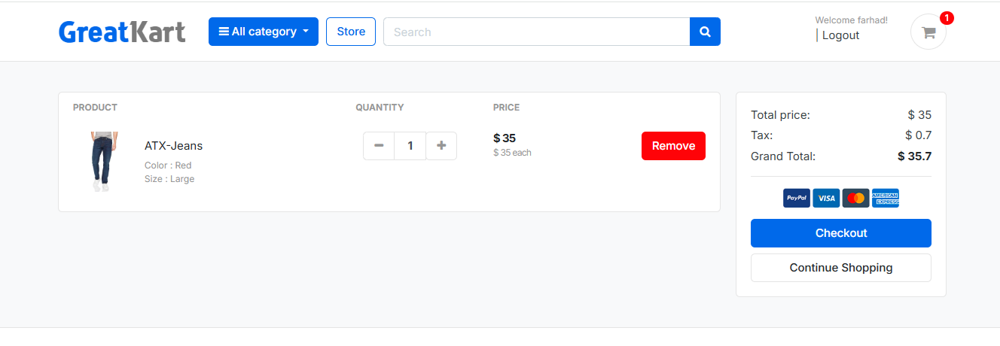
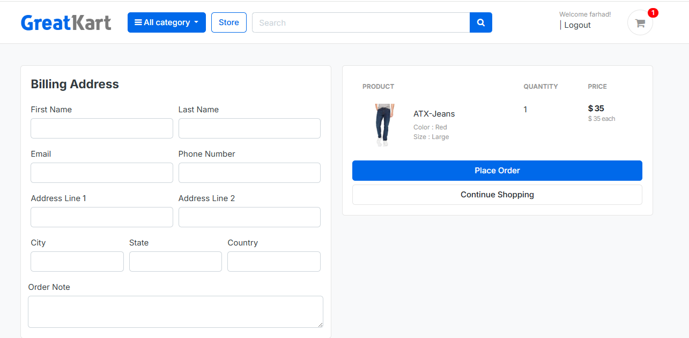

# Django E-Commerce Clothing Store

A full-featured e-commerce web application for a clothing/fashion store, built with Django. It includes product catalog browsing with categories and variations (color/size), a shopping cart, checkout and order management, user accounts with email verification, and a review & rating system.




## Features

- **Product Catalog** — Browse products by category, view product details, and filter by variations such as color and size
- **Search** — Keyword search across the product catalog
- **Shopping Cart** — Add, update, and remove items, with per-session and per-user cart handling
- **Checkout & Orders** — Place orders, track order status, and view order history and details
- **User Accounts** — Registration with email verification, login/logout, password reset via email, profile editing, and password change
- **User Dashboard** — View past orders and manage account details
- **Product Reviews & Ratings** — Customers can submit and view product reviews
- **Product Image Gallery** — Multiple images per product
- **Admin Panel** — Manage products, categories, orders, and reviews via Django's built-in admin (with thumbnail previews)

## Tech Stack

- **Backend:** Django 6.0
- **Database:** SQLite (default, easily swappable for PostgreSQL/MySQL)
- **Email:** Django SMTP backend (Gmail) for account verification and password reset emails
- **Image Handling:** Pillow, django-admin-thumbnails
- **Config:** python-decouple for environment-based settings

## Project Structure

```
django-ecommerce-clothing/
├── fashion_store/       # Project settings, URLs, WSGI/ASGI config
├── accounts/            # User registration, auth, profile, dashboard
├── category/            # Product categories
├── store/                # Products, variations, reviews, product gallery
├── carts/                # Shopping cart logic
├── orders/                # Checkout, orders, payments
├── templates/            # HTML templates (base, store, accounts, orders, includes)
├── static/                # CSS, JS, fonts, images
├── media/                  # User-uploaded product/profile images
└── manage.py
```

## Getting Started

### Prerequisites

- Python 3.10+
- pip

### Installation

1. **Clone the repository**
   ```bash
   git clone https://github.com/<your-username>/django-ecommerce-clothing.git
   cd django-ecommerce-clothing
   ```

2. **Create and activate a virtual environment**
   ```bash
   python -m venv env
   # Windows
   env\Scripts\activate
   # macOS/Linux
   source env/bin/activate
   ```

3. **Install dependencies**
   ```bash
   pip install django pillow django-admin-thumbnails python-decouple requests
   ```

4. **Configure environment variables**

   Create a `.env` file in the project root:
   ```env
   EMAIL_HOST_USER=your-email@gmail.com
   EMAIL_HOST_PASSWORD=your-app-password
   ```
   > Use a Gmail [App Password](https://support.google.com/accounts/answer/185833) rather than your regular account password.

5. **Apply migrations**
   ```bash
   python manage.py migrate
   ```

6. **Create a superuser** (to access the admin panel)
   ```bash
   python manage.py createsuperuser
   ```

7. **Run the development server**
   ```bash
   python manage.py runserver
   ```

8. Visit `http://127.0.0.1:8000/` in your browser, and `http://127.0.0.1:8000/admin/` for the admin panel.

## Configuration Notes

- `AUTH_USER_MODEL` is set to a custom `accounts.Account` model.
- Email sending (account activation, password reset, order confirmation) requires valid SMTP credentials in `.env`.
- `DEBUG = True` and `SECRET_KEY` are set for local development in `settings.py` — **change both before deploying to production**, and add your domain to `ALLOWED_HOSTS`.
- Media files (product images, profile photos) are stored under `media/` and served locally in development.

## Roadmap / Ideas for Contribution

- Integrate a payment gateway (Stripe/PayPal/Razorpay)
- Add product filtering by price range
- Add wishlist functionality
- Write automated tests for cart and checkout flows
- Add Docker support for easier deployment

## Contributing

Contributions are welcome. Please open an issue to discuss any major changes before submitting a pull request.

1. Fork the repository
2. Create a feature branch (`git checkout -b feature/your-feature`)
3. Commit your changes
4. Push to the branch and open a pull request

